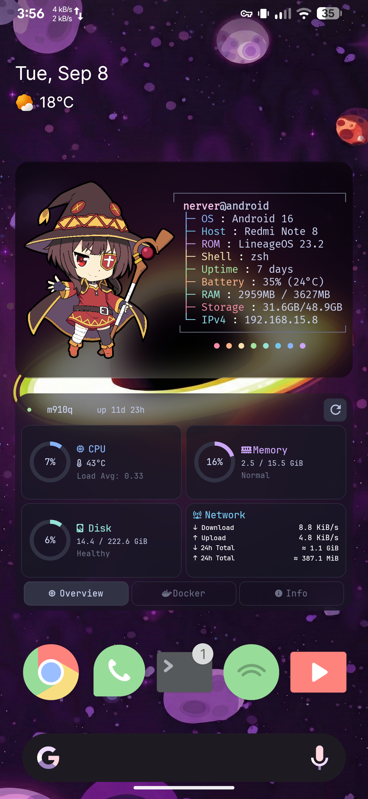
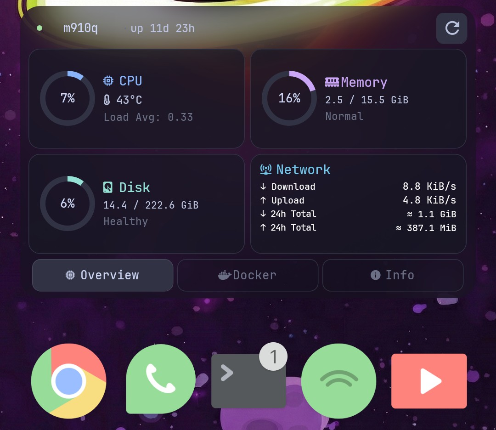
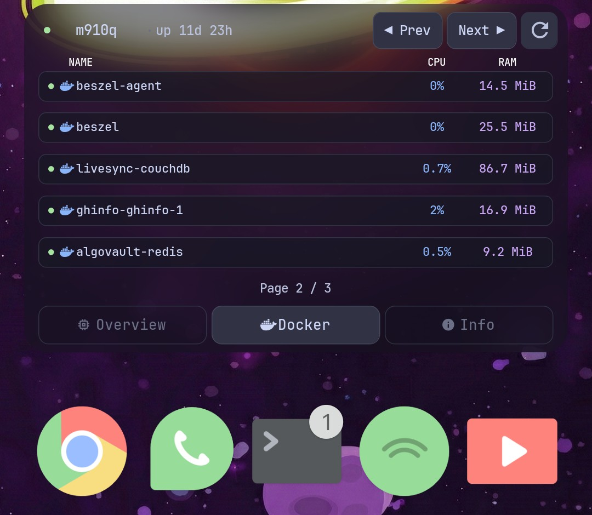
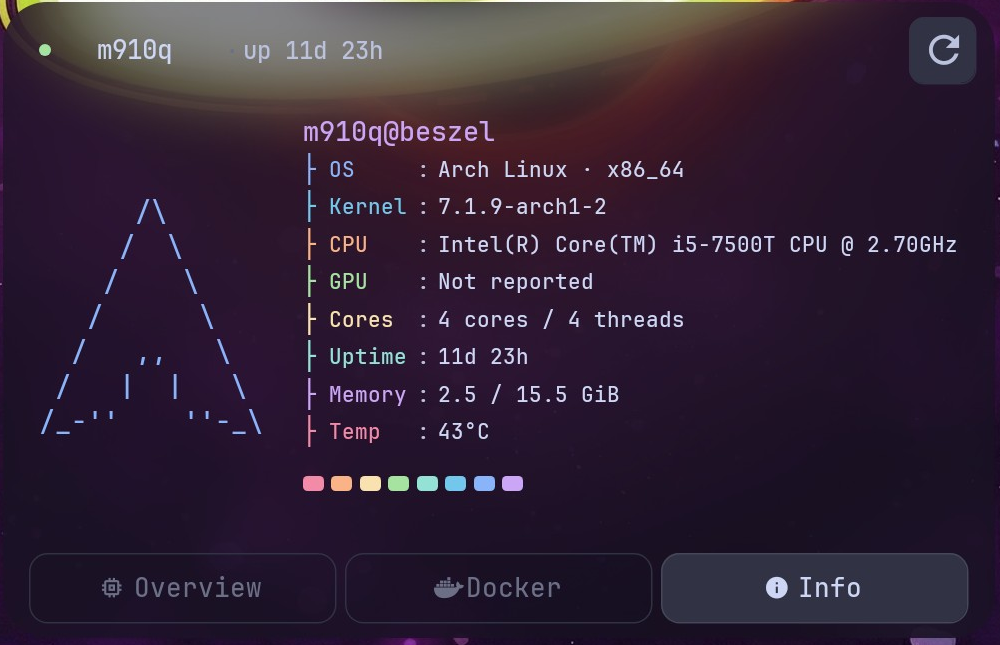

# 🖥️ Beszel Homelab Monitor for Android (KWGT)

<p align="center">
  
</p>

<p align="center">
  <strong>A modern, Unix-riced homelab monitoring widget for Android/KWGT, consuming the Beszel Hub REST API directly with zero middleman or proxy services.</strong>
</p>

<p align="center">
  
  
  
  
  
  
</p>

---

## ✨ Highlights & Features

- **Direct Hub-to-Client**: Your Android phone communicates directly with your Beszel Hub (PocketBase REST API). No third-party servers, cloud bridges, or proxy microservices.
- **Catppuccin Mocha Palette**: High-contrast, OLED-friendly colors with deep translucent cards and frosted-glass depth.
- **Three Interactive Tabbed Views**:
  - **Overview**: Circular gauges for CPU, RAM, Disk, Load Average, Temperature, and Network I/O rates + 24-hour total traffic.
  - **Docker Containers**: Live container list with real-time status dots (🟢 running / 🔴 stopped or unhealthy), CPU %, RAM usage, and ◀ Prev / Next ▶ pagination.
  - **System Info (Fastfetch)**: Distro-specific ASCII art (Arch, Debian, Ubuntu, Fedora, Alpine, etc.), Kernel, CPU model, Core/Thread counts, Uptime, and terminal ANSI color blocks.
- **Multi-Host Switching**: Tap the hostname in the header bar to cycle seamlessly through all registered homelab servers.
- **Zero-Loss Caching**: Temporary network dropouts never blank your screen; last-known metrics are preserved with a visual status indicator.
- **Works with KWGT Free & Pro**: Fully importable via clipboard without purchasing KWGT Pro.

---

## 📸 Widget Views

<table align="center">
  <tr>
    <th align="center">📊 System Overview</th>
    <th align="center">🐳 Docker Containers</th>
    <th align="center">🐧 Host Info (Fastfetch)</th>
  </tr>
  <tr>
    <td align="center">
      
      <br/>
      <em>CPU, RAM, Disk, Temps & Network I/O</em>
    </td>
    <td align="center">
      
      <br/>
      <em>Container state, usage & pagination</em>
    </td>
    <td align="center">
      
      <br/>
      <em>Fastfetch-style ASCII distro art & hardware specs</em>
    </td>
  </tr>
</table>

---

## 📋 Prerequisites & Quick Setup

This widget connects directly to your [Beszel](https://github.com/henrygd/beszel) Hub.

### Prerequisites
1. **Running Beszel Hub**: An active Beszel server instance with your account (the email and password you created during initial Beszel setup).
2. **Network Reachability**: Your Android device must be able to reach your Hub (via local Wi-Fi, LAN, or VPN like Tailscale/WireGuard).
3. **Android Device with KWGT**: Installed from Google Play (Free or Pro both supported).

---

## 🔑 Authentication: Long-Lived Token (PAT) Setup

Android widgets operate as **headless clients**: they cannot prompt for interactive logins or perform background HTTP POST session renewals. By default, PocketBase auth tokens expire after 5 days (`432000` seconds), which causes the widget to freeze on cached data once expired.

To achieve a true **"Set & Forget"** setup without compromising security (avoiding insecure public/unlocked API rules), configure your token as a **Personal Access Token (PAT) / API Key** valid for 1 year (`31536000` seconds):

> [!TIP]
> **Why a PAT instead of Unlocked/Public API Rules?**
> In accordance with the *Defense in Depth* principle, a PAT keeps all endpoints protected by an `Authorization` header. Telemetry data (internal IPs, Docker container names, hostnames) is never exposed to unauthenticated network scanners. If your device is ever lost or replaced, you can instantly revoke the token with a single click in PocketBase without altering firewall or database rules.

### How to Configure in PocketBase Admin

1. Open your Beszel PocketBase Admin panel in your browser:
   ```text
   http://<your-hub-ip>:8090/_/
   ```
2. In the left sidebar under **Collections**, select the **`users`** collection.
3. **Unhide Collection Settings**:
   Beszel hides administrative collection controls by default via CSS (`hideControls: true`). To make the settings button visible:
   - Open your browser's Developer Tools Console (<kbd>F12</kbd> or <kbd>Ctrl</kbd>+<kbd>Shift</kbd>+<kbd>J</kbd>).
   - Paste and run this one-line snippet:
     ```javascript
     document.querySelector('.app').classList.remove('hide-controls')
     ```
   - The **Collection settings (⚙️ gear icon)** will immediately appear in the top header, directly to the left of the circular Refresh button (`↻`).
4. Click the **⚙️ gear icon** (*Collection settings*).
5. In the slide-over panel, switch to the **Options** tab (the 3rd tab, next to *Fields* and *API rules*).
6. Scroll down to the **Other** section and expand:
   👉 **Token options (invalidate, duration)**
7. In the **Auth duration (in seconds) \*** field:
   - Change the value from `432000` to **`31536000`** (1 year) or **`63072000`** (2 years).
8. Click **Save changes** in the bottom right.

> [!NOTE]
> **Best Practice (Dedicated Widget User)**: For optimal privilege isolation, you can create a dedicated user in Beszel (e.g. `kwgt@local` with role `readonly`) and generate the widget token using those credentials rather than your primary admin account.

---

## ⚡ Setup Wizard (`setup.py`)

Run the interactive setup wizard on your machine. It connects to your Beszel Hub using your login credentials, discovers all registered servers, and compiles customized widget presets (`dist/beszel_monitor.clip` and `dist/beszel_monitor.kwgt`) with your settings pre-filled:

```bash
python3 setup.py
```

```text
╔══════════════════════════════════════════════════════════════════╗
║                         Beszel Monitor                           ║
╚══════════════════════════════════════════════════════════════════╝

Enter Beszel Hub URL [http://127.0.0.1:8090]: http://192.168.1.100:8090
Enter username/email: user@example.com
Enter password:
✓ Authenticated successfully as user!
✓ Discovered 2 systems:
  [1] homelab (up)
  [2] storage-nas (up)
Select server to monitor by default [1]: 1

✓ Built dist/beszel_monitor.kwgt
✓ Built dist/beszel_monitor.clip
```

The script automatically generates ready-to-import bundles inside the `dist/` directory.

---

## 📲 Importing into KWGT (Step-by-Step)

### Method 1: Clipboard Import (100% Free — No KWGT Pro Key Required!)

> [!IMPORTANT]
> **The Clipboard Trick**: KWGT does not automatically display clipboard paste options on a fresh widget. Follow this exact sequence to trigger the clipboard prompt:

1. **Copy the clip content**:
   - Open `dist/beszel_monitor.clip` (or `widget/beszel_monitor.clip`).
   - Copy the entire file content to your Android device\'s clipboard (ensuring the header `##KUSTOMCLIP##` is included).
2. **Add a blank widget**:
   - Long-press an empty area on your Android home screen → tap **Widgets**.
   - Select **KWGT Kustom Widget** and drag a **4×2** or **4×3** widget onto your screen.
3. **Open the editor**:
   - Tap the empty widget on your home screen to open the KWGT editor.
4. **Trigger the Clipboard Import**:
   - In the top right toolbar, tap the **`+` (Add)** icon.
   - Tap **Komponent**.
   - **The Trick**: Now, immediately press your phone\'s **Back button** (or perform your Android back swipe gesture) to exit the Komponent file browser.
   - Upon backing out, KWGT will detect the clipboard content and display a **"Paste Komponent from Clipboard"** prompt. Tap the clipboard icon in the top right to paste!
5. **Save**:
   - Tap the **Floppy Disk (Save)** icon in the top right.

### Method 2: Preset Import (Requires KWGT Pro)

1. Copy `dist/beszel_monitor.kwgt` to your phone\'s `/sdcard/Kustom/widgets/` directory.
2. Place a blank KWGT widget on your home screen and tap it.
3. Switch to the **Library** tab → select **Exported** → choose **Beszel Monitor**.
4. Tap the **Floppy Disk (Save)** icon.

---

## 🔧 Essential Post-Import Setup

### 1. Activating Nerd Font Glyphs
The widget uses **JetBrainsMono Nerd Font** for clean system glyphs (CPU, Docker whale, disk, network, thermometers). On a fresh import, Android may show placeholder rectangles until the font is loaded into Kustom\'s active cache.

> [!TIP]
> **One-Touch Font Activation**:
> 1. Open the widget in KWGT and expand any text element (e.g., inside `Header` or `Overview`).
> 2. Tap on the **Font** property to open the font selector.
> 3. Select `JetBrainsMonoNerdFont.ttf` (bundled inside the preset or from your fonts directory).
> 4. Once selected in any single element, KWGT registers the font globally across all modules and icons immediately!

### 2. Enabling the Frosted-Glass (Glossy) Wallpaper Effect
To achieve authentic frosted-glass translucency that matches your launcher wallpaper:

1. Inside KWGT, navigate to the root item list and locate the **`GlossyWallpaper`** layer.
2. Select **Bitmap** and pick your current phone wallpaper from your gallery.
3. Adjust the **Position** offset (X and Y offsets) or **Scale** so that the widget\'s background aligns with your home screen wallpaper framing.
4. The translucent cards will now create a realistic glassmorphism depth effect over your background!

### 3. Adjusting Scale
Depending on your screen resolution and launcher grid (e.g. Nova, Lawnchair, OneUI):
- In the KWGT editor, select the root **Layer** tab.
- Adjust the **Scale** slider until the widget cleanly fills the container boundaries without clipping.

---

## ⚙️ Global Variables Reference

If you need to customize connections, colors, or refresh frequencies manually, go to the **Globals** tab in KWGT:

| Variable | Type | Default | Description |
|---|---|---|---|
| `bz_url` | Text | `http://192.168.1.100:8090` | Beszel Hub base URL (no trailing slash). |
| `bz_host` | Text | `homelab` | Default hostname to display on load. |
| `bz_token` | Text | *(empty)* | PocketBase JWT token (leave empty if API rules are unlocked). |
| `accent` | Color | `#cba6f7` | Catppuccin Mauve accent color for active tabs and highlights. |
| `bg` | Color | `#1e1e2e` | Catppuccin Base background color. |
| `card_bg` | Color | `#181825` | Dark surface color for metric cards. |
| `pg_size` | Number | `5` | Number of Docker containers shown per page. |
| `debug` | Number | `0` | Set to `1` to output diagnostic error traces. |

---

## 🎮 Navigation & Touch Controls

- **Tab Switching**: Tap `[ Overview ]`, `[ Docker ]`, or `[ Info ]` in the bottom bar to switch views.
- **Host Cycling**: Tap the **hostname** in the top-left header to cycle across all servers registered in your Hub.
- **Manual Refresh**: Tap the **↻** icon in the top-right header to trigger an immediate metrics update.
- **Docker Pagination**: Tap **◀ Prev** and **Next ▶** to navigate through pages of containers.
- **Status Indicator**:
  - 🟢 **Green**: Connected, telemetry fresh, server is up.
  - 🟡 **Yellow**: Stale cache (hub unreachable; showing last-known metrics).
  - 🔴 **Red**: Server down or authentication failed.

---

## 🏗️ Architecture & Privacy

```text
┌────────────────────────────────────────────────────────┐
│                  Android Device (KWGT)                 │
│                                                        │
│   ┌────────────────────────────────────────────────┐   │
│   │                 Beszel Monitor                 │   │
│   │                                                │   │
│   │  [Overview]        [Docker]        [Fastfetch] │   │
│   └────────────────────────────────────────────────┘   │
│                           │                            │
│                  Direct HTTP(S) REST                   │
│             (Local LAN / WireGuard / Tailscale)        │
└───────────────────────────┼────────────────────────────┘
                            ▼
┌────────────────────────────────────────────────────────┐
│                   Beszel Hub Server                    │
│                                                        │
│               PocketBase REST API (:8090)              │
│       /api/collections/systems/records                 │
│       /api/collections/container_stats/records         │
│       /api/collections/system_stats/records            │
└────────────────────────────────────────────────────────┘
```

- **Zero Cloud Leakage**: No telemetry, analytics, or credentials ever leave your local network or VPN tunnel.
- **Decoupled Architecture**: Raw PocketBase JSON payloads are parsed and normalized into standard Kustom structures.
- **Graceful Degradation**: If Wi-Fi drops or the server reboots, the widget retains its previous state and updates the status indicator rather than blanking out.

---

## 🧪 Development & Testing

The repository includes a comprehensive unit test suite validating formulas, data contracts, pagination, and layout trees:

```bash
# Run test suite
python3 -m unittest discover -s scripts -p "test_*.py"

# Regenerate presets and clipboard files
python3 scripts/generate_preset.py
```

---

## 📚 Documentation Index
 
Technical guides and specifications are organized inside the [`docs/`](docs/) directory:

- [Architecture & Constraints](docs/ARCHITECTURE.md) — System boundaries, data paths, and caching policies.
- [Data Contract](docs/DATA_CONTRACT.md) — Beszel REST API schemas and JSON field mappings.
- [KWGT Build Guide](docs/KWGT_BUILD_GUIDE.md) — Step-by-step layer assembly and Kustom formula details.
- [Widget Specification](docs/WIDGET_SPEC.md) — Screen dimensions, typography, and layout mockups.
- [Security Policy](docs/SECURITY.md) — Threat model, secrets quarantine, and network boundaries.

---

## 📄 License

Distributed under the **MIT License**. Distro ASCII art adapted from [Fastfetch](https://github.com/fastfetch-cli/fastfetch) under MIT.
Catppuccin color palette under MIT by [Catppuccin Org](https://github.com/catppuccin/catppuccin).
