# BeszelFetch Theme System

BeszelFetch features a first-class, build-time Linux/Unix ricing theme system supporting 32 curated palettes from popular terminal, editor, and desktop environments.

Themes are applied during generation and compiled directly into Kustom globals. There is **zero runtime overhead** inside KWGT, no external API calls for theming, and no runtime JSON parsing in Android.

---

## Architecture

```text
[themes/*.json]
      │
      ▼
[theme_catalog.py] ──> [setup.py] ──> [generate_clip.py] ──> [.clip / .kwgt]
      │                     │
      ▼                     ▼
[validate_themes.py]  [Interactive Arrow Selector]
[theme_preview.py]    [TrueColor ANSI Swatches]
```

### Key Principles

1. **Build-Time Selection:** Theme selection happens when configuring and generating the widget via `setup.py` or `generate_clip.py`.
2. **Structural Invariance:** Every theme produces the exact same widget tree, shapes, touch targets, and formulas. Only colors change.
3. **Semantic Decoupling:** Generator code references normalized semantic roles (`c_base`, `c_text`, `c_cpu`, `c_accent`, etc.), preventing vendor lock-in to specific palette naming conventions.
4. **WCAG 2.1 AA Contrast Compliance:** Rendered text and metric graphics are checked against 4.5:1 and 3:1 respectively over black and white backdrops, including fallback states.
5. **No Palette Leakage:** Generator and layout templates contain zero hardcoded Catppuccin literals. Regression checks reject leaked Mocha colors while allowing colors legitimately shared by upstream palettes.
6. **Catppuccin Mocha as Default:** Running without `--theme` defaults to `catppuccin-mocha`, preserving existing visual identity.

---

## Curated Themes Catalog

The repository includes 32 curated themes:

| Theme ID | Display Name | Mode | Upstream Project | Pinned Revision | License |
| :--- | :--- | :--- | :--- | :--- | :--- |
| `ayu-dark` | Ayu Dark | Dark | [ayu-theme/ayu-colors](https://github.com/ayu-theme/ayu-colors/blob/b0fd979a1ddf050101b43311fa598a1a9c5f1bbc/themes/dark.yaml) | `b0fd979a` | MIT |
| `ayu-light` | Ayu Light | Light | [ayu-theme/ayu-colors](https://github.com/ayu-theme/ayu-colors/blob/b0fd979a1ddf050101b43311fa598a1a9c5f1bbc/themes/light.yaml) | `b0fd979a` | MIT |
| `ayu-mirage` | Ayu Mirage | Dark | [ayu-theme/ayu-colors](https://github.com/ayu-theme/ayu-colors/blob/b0fd979a1ddf050101b43311fa598a1a9c5f1bbc/themes/mirage.yaml) | `b0fd979a` | MIT |
| `catppuccin-frappe` | Catppuccin Frappé | Dark | [catppuccin/palette](https://github.com/catppuccin/palette/blob/07d02aa110ef9eb7e7427afca5c73ba9cf7f8ebd/palette.json) | `07d02aa1` | MIT |
| `catppuccin-latte` | Catppuccin Latte | Light | [catppuccin/palette](https://github.com/catppuccin/palette/blob/07d02aa110ef9eb7e7427afca5c73ba9cf7f8ebd/palette.json) | `07d02aa1` | MIT |
| `catppuccin-macchiato` | Catppuccin Macchiato | Dark | [catppuccin/palette](https://github.com/catppuccin/palette/blob/07d02aa110ef9eb7e7427afca5c73ba9cf7f8ebd/palette.json) | `07d02aa1` | MIT |
| `catppuccin-mocha` | Catppuccin Mocha | Dark | [catppuccin/palette](https://github.com/catppuccin/palette/blob/07d02aa110ef9eb7e7427afca5c73ba9cf7f8ebd/palette.json) | `07d02aa1` | MIT |
| `dracula` | Dracula | Dark | [dracula/dracula-theme](https://github.com/dracula/dracula-theme/blob/1e04a4b768302fa2de37d09cc7b8087eabcd3ed8/README.md) | `1e04a4b7` | MIT |
| `everforest-dark` | Everforest Dark | Dark | [sainnhe/everforest](https://github.com/sainnhe/everforest/blob/85a86eb62409e3ec88713bff3d1b9d7374e112e4/autoload/everforest.vim) | `85a86eb6` | MIT |
| `everforest-light` | Everforest Light | Light | [sainnhe/everforest](https://github.com/sainnhe/everforest/blob/85a86eb62409e3ec88713bff3d1b9d7374e112e4/autoload/everforest.vim) | `85a86eb6` | MIT |
| `gruvbox-dark` | Gruvbox Dark | Dark | [morhetz/gruvbox](https://github.com/morhetz/gruvbox/blob/ef8864bb42bf244f0295d1c5a403b27e3d139695/colors/gruvbox.vim) | `ef8864bb` | MIT |
| `gruvbox-light` | Gruvbox Light | Light | [morhetz/gruvbox](https://github.com/morhetz/gruvbox/blob/ef8864bb42bf244f0295d1c5a403b27e3d139695/colors/gruvbox.vim) | `ef8864bb` | MIT |
| `kanagawa-dragon` | Kanagawa Dragon | Dark | [rebelot/kanagawa.nvim](https://github.com/rebelot/kanagawa.nvim/blob/bb85e4bfc8d89b0e62c8fa53ccdd13d12e2f77b3/lua/kanagawa/colors.lua) | `bb85e4bf` | MIT |
| `kanagawa-lotus` | Kanagawa Lotus | Light | [rebelot/kanagawa.nvim](https://github.com/rebelot/kanagawa.nvim/blob/bb85e4bfc8d89b0e62c8fa53ccdd13d12e2f77b3/lua/kanagawa/colors.lua) | `bb85e4bf` | MIT |
| `kanagawa-wave` | Kanagawa Wave | Dark | [rebelot/kanagawa.nvim](https://github.com/rebelot/kanagawa.nvim/blob/bb85e4bfc8d89b0e62c8fa53ccdd13d12e2f77b3/lua/kanagawa/colors.lua) | `bb85e4bf` | MIT |
| `monokai` | Monokai | Dark | [tinted-theming/schemes](https://github.com/tinted-theming/schemes/blob/d70255b752ac8328ee3d549c72a1a55ce5fc794f/base16/monokai.yaml) | `d70255b7` | MIT |
| `nightfox` | Nightfox | Dark | [EdenEast/nightfox.nvim](https://github.com/EdenEast/nightfox.nvim/blob/4dacd3f0185a2227bdf3b6c0975a8f0bf87cac9a/lua/nightfox/palette/nightfox.lua) | `4dacd3f0` | MIT |
| `nord` | Nord | Dark | [nordtheme/nord](https://github.com/nordtheme/nord/blob/1cef71605416a222e57225b544540ce0fcec18d4/src/nord.css) | `1cef7160` | MIT |
| `one-dark` | One Dark | Dark | [atom/one-dark-syntax](https://github.com/atom/one-dark-syntax/blob/9c96f4454362267ac45322063e193ccf9d2debb1/styles/colors.less) | `9c96f445` | MIT |
| `one-light` | One Light | Light | [atom/one-light-syntax](https://github.com/atom/one-light-syntax/blob/d84579027410c576086dfca14d934c4bd74b0438/styles/colors.less) | `d8457902` | MIT |
| `oxocarbon-dark` | Oxocarbon Dark | Dark | [nyoom-engineering/oxocarbon.nvim](https://github.com/nyoom-engineering/oxocarbon.nvim/blob/cd6523a0836d6e8ee823d343149fd06c7b71fdde/lua/oxocarbon/init.lua) | `cd6523a0` | MIT |
| `palenight` | Material Palenight | Dark | [tinted-theming/schemes](https://github.com/tinted-theming/schemes/blob/d70255b752ac8328ee3d549c72a1a55ce5fc794f/base16/material-palenight.yaml) | `d70255b7` | MIT |
| `rose-pine` | Rosé Pine | Dark | [rose-pine/palette](https://github.com/rose-pine/palette/blob/92af52b465ab6e47437aca223c9b8d3009a2023b/palette.json) | `92af52b4` | MIT |
| `rose-pine-dawn` | Rosé Pine Dawn | Light | [rose-pine/palette](https://github.com/rose-pine/palette/blob/92af52b465ab6e47437aca223c9b8d3009a2023b/palette.json) | `92af52b4` | MIT |
| `rose-pine-moon` | Rosé Pine Moon | Dark | [rose-pine/palette](https://github.com/rose-pine/palette/blob/92af52b465ab6e47437aca223c9b8d3009a2023b/palette.json) | `92af52b4` | MIT |
| `solarized-dark` | Solarized Dark | Dark | [altercation/solarized](https://github.com/altercation/solarized/blob/62f656a02f93c5190a8753159e34b385588d5ff3/README.md) | `62f656a0` | MIT |
| `solarized-light` | Solarized Light | Light | [altercation/solarized](https://github.com/altercation/solarized/blob/62f656a02f93c5190a8753159e34b385588d5ff3/README.md) | `62f656a0` | MIT |
| `tokyo-night` | Tokyo Night | Dark | [folke/tokyonight.nvim](https://github.com/folke/tokyonight.nvim/blob/cdc07ac78467a233fd62c493de29a17e0cf2b2b6/extras/lua/tokyonight_night.lua) | `cdc07ac7` | Apache-2.0 |
| `tokyo-night-day` | Tokyo Night Day | Light | [folke/tokyonight.nvim](https://github.com/folke/tokyonight.nvim/blob/cdc07ac78467a233fd62c493de29a17e0cf2b2b6/extras/lua/tokyonight_day.lua) | `cdc07ac7` | Apache-2.0 |
| `tokyo-night-moon` | Tokyo Night Moon | Dark | [folke/tokyonight.nvim](https://github.com/folke/tokyonight.nvim/blob/cdc07ac78467a233fd62c493de29a17e0cf2b2b6/extras/lua/tokyonight_moon.lua) | `cdc07ac7` | Apache-2.0 |
| `tokyo-night-storm` | Tokyo Night Storm | Dark | [folke/tokyonight.nvim](https://github.com/folke/tokyonight.nvim/blob/cdc07ac78467a233fd62c493de29a17e0cf2b2b6/extras/lua/tokyonight_storm.lua) | `cdc07ac7` | Apache-2.0 |
| `tomorrow-night` | Tomorrow Night | Dark | [chriskempson/tomorrow-theme](https://github.com/chriskempson/tomorrow-theme/blob/ccf6666d888198d341b26b3a99d0bc96500ad503/vim/colors/Tomorrow-Night.vim) | `ccf6666d` | MIT |

---

## Selecting a Theme

### 1. Interactive Setup Wizard

Running `setup.py` on a standard terminal launches an interactive theme selector:

```bash
python setup.py
```

- **↑ / ↓** or **k / j**: Navigate themes
- **Enter**: Confirm selection
- **Esc**: Revert to default (`catppuccin-mocha`)
- Scrolling viewport shows 8 themes at a time with indicators when additional themes exist above or below.
- TrueColor ANSI swatches display core metric and accent colors live in your terminal.

### 2. Command-Line Flag

Pass `--theme <id>` to bypass interactive selection:

```bash
python setup.py --theme tokyo-night-storm
```

Or when generating clips directly:

```bash
python scripts/generate_clip.py --theme nord --output-dir dist/
```

### 3. Listing Available Themes

```bash
python setup.py --list-themes
```

---

## Accessibility and Contrast

Canonical `colors` are reproduced from checksum-pinned files in
`themes/upstream/`; accessibility corrections never rewrite them. Semantic
assignments select one palette entry for each role. Build-time resolution creates
separate colors for decorative rings (`c_cpu`, `c_ram`, etc.) and small text
(`c_cpu_text`, `c_ram_text`, etc.). Primary, secondary and muted text also receive
minimal contrast corrections where their upstream colors are too faint.

The resolver mixes toward white on dark themes and black on light themes only
when needed. Targets are 4.6:1 for text and 3.1:1 for graphics, giving rounding
headroom above the 4.5:1 / 3:1 checks. Background contexts include translucent
base/cards/tabs over black and white, opaque card surfaces, selected surfaces and the ring track.
Selected tabs and refresh/pagination actions use `c_selected`, an accent tint
of the theme's alternate background. Ring backgrounds use `c_track`.

`scripts/widget_theme.py` activates native color bindings, applies readable text
companions, and binds shared header/actions/navigation to the main accent.
Network details and Docker headings now have explicit active bindings. Geometry,
visibility, thresholds, data expressions and touch actions stay invariant.

`validate_themes.py` checks exact upstream extraction, active bindings and colors
emitted in Overview, Docker and Info for normal/stale/empty/missing/alert states.
The rendered audit composites filled shapes at text centers and checks rings
against their track and surrounding background, plus status dots and active/action
outlines. Decorative distro art uses the
3:1 graphic target. It does not model antialiasing, wallpaper blur, patterned
backgrounds, or Android rendering; native confirmation remains necessary.

### Palette sources and variants

The manifest fixes a full commit, file, variant, SHA-256 and license evidence for
every source. Normal validation works offline; refreshing never follows HEAD:

```sh
python3 scripts/theme_sources.py
python3 scripts/theme_sources.py --fetch
```

- Atom One Dark/Light use the original syntax palettes, resolving HSL and Less
  aliases without intermediate RGB rounding.
- Tokyo Night uses the official generated default Lua export for each style.
- Kanagawa uses its named master colors with Wave/Dragon/Lotus background and
  foreground choices; Lotus uses the real paper and ink colors.
- Everforest and Gruvbox explicitly use medium contrast variants.
- Monokai and Palenight intentionally use the pinned Base16 definitions.
- Ayu uses the literal RGB seed palettes for each YAML variant, excluding the
  generated OKLCH ramps and modifiers. This is a stated widget palette choice,
  rather than a claim to reproduce every editor highlight.
- Solarized uses its canonical 16 colors; Tomorrow uses its GUI palette.
- Oxocarbon uses its native dark branch, including neutral HSLuv blends. Its
  palette has no amber/orange: app-only `derived_colors` rotate its error seed to
  42°/25° HSV for warning/high. These documented extensions preserve status
  meanings and are kept outside canonical `colors`.

### Family identity

| Family | Main accent / CPU | RAM | Disk | Network |
| --- | --- | --- | --- | --- |
| Catppuccin | Mauve / blue | Mauve | Teal | Sapphire |
| Ayu | Gold / orange | Purple | Teal | Blue |
| Dracula | Purple / green | Pink | Cyan | Purple |
| Gruvbox | Orange | Yellow | Green | Aqua |
| Everforest | Green | Yellow | Aqua | Blue |
| Kanagawa Wave | Gold | Violet | Aqua | Crystal blue |
| Kanagawa Dragon | Orange | Pink | Green | Blue |
| Kanagawa Lotus | Orange | Violet ink | Green | Blue |
| Monokai | Green | Pink | Purple | Cyan |
| Nord | Frost cyan | Frost blue | Frost teal | Deep blue |
| Rosé Pine | Rose | Iris | Pine | Gold |
| Solarized | Blue | Violet | Cyan | Magenta |
| Tomorrow Night | Blue | Orange | Green | Aqua |

Sibling variants retain their shared metric roles. Distinction between unrelated
families comes from palette-specific backgrounds, text, prominent main accents
and metric assignments. Status roles remain success/warning/high/error with
existing labels and conditions; sibling similarity is intentional.

### Opacity Policy

- **Dark Themes:**
  - Base (`c_base`): 85% opacity (`0xD9`)
  - Mantle (`c_mantle`): 70% opacity (`0xB3`)
  - Tab Inactive: 15% opacity (`0x25`)
- **Light Themes:**
  - Base (`c_base`): 95% opacity (`0xF2`)
  - Mantle (`c_mantle`): 90% opacity (`0xE6`)
  - Tab Inactive: 15% opacity (`0x25`)

---

## Visual Preview Gallery

Generate the offline gallery for all 32 themes:

```bash
python scripts/theme_preview.py
```

Open `dist/theme-preview.html` in a browser. Browse one theme at a time with the
selector or arrows, filter dark/light themes, or enable **Show all themes**.
Each theme has separate **Overview**, **Docker**, and **Info** views. The widget
tabs switch views; Docker's Prev/Next buttons switch between three synthetic
pages, including long names and a partially filled last page. Keyboard activation
uses Enter or Space.

The renderer consumes `build_kustom_clip(write_outputs=False, theme=...)`, the
same generated module tree used for the widget. It evaluates serialized layout,
text, progress, colors, alpha, and visibility with synthetic cached globals from
`examples/fixtures/theme-preview.json`. It embeds the widget's JetBrains Mono
Nerd Font, uses its glyph metrics, and treats `CLIP_ALL` shapes as clipping masks
instead of visible value boxes. No widget artifact is rewritten by this command.

The HTML embeds the font, SVGs and controls; opening it requires no Hub or network
connection. Black/white/gray/custom backdrops help inspect translucent colors.
An optional local image stays in the browser and is not uploaded. It is a
backdrop, not an emulation of Kustom's wallpaper blur/dim effects.

```bash
# Alternate cached-data states; stale keeps the last valid metrics.
python scripts/theme_preview.py --state stale --output dist/theme-preview-stale.html
python scripts/theme_preview.py --state empty --output dist/theme-preview-empty.html
python scripts/theme_preview.py --state missing --output dist/theme-preview-missing.html
python scripts/theme_preview.py --state alert --output dist/theme-preview-alert.html

# Inspect one theme at a different frame size, or export all three SVG views.
python scripts/theme_preview.py --theme nord --width 480 --height 376 --view info
python scripts/theme_preview.py --svg-dir dist/theme-svg
```

The default frame is 660 × 424 Kustom units, approximating the inspected device
capture. Use the CLI to match another widget size (minimum height 376). Native
captures informed circle stroke bounds and TextModule visibility behavior;
containing layers still determine which view is shown. Unsupported modules,
bindings and formulas raise errors instead of silently substituting a mock.

This is an offline rendering of the supported generated module subset, not a
KWGT emulator. Native text baselines, launcher scaling, wallpaper effects,
animation, Flows and touch actions still require device confirmation. Gallery
controls simulate navigation only; they never execute HTTP or native Flows.

## Static Theme Previews

The README features the native Mocha screenshots plus mock previews for Dracula, Gruvbox Dark and Tokyo Night Day. This gallery shows all other themes: 28 palettes × three views. Every image is rendered from the generated widget tree with synthetic fixture data, then clipped to the 22-unit rounded widget frame (no gallery page, browser controls or stage padding). The PNGs keep the outer corners transparent. Translucent colors inside the widget are composited over black for dark palettes and white for light palettes so GitHub shows the theme surfaces as intended.

<table>
  <thead><tr><th align="left">Theme</th><th align="center">Overview</th><th align="center">Docker</th><th align="center">Host info</th></tr></thead>
  <tbody>
    <tr><th align="left">Ayu Dark</th>
      <td align="center">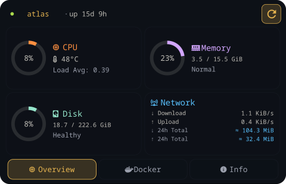</td>
      <td align="center">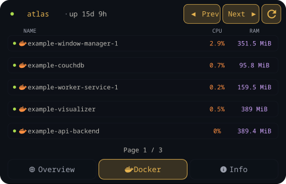</td>
      <td align="center">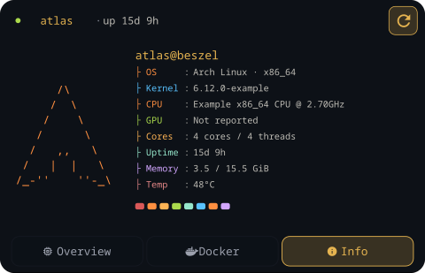</td>
    </tr>
    <tr><th align="left">Ayu Light</th>
      <td align="center">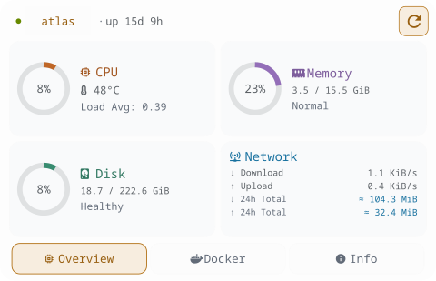</td>
      <td align="center">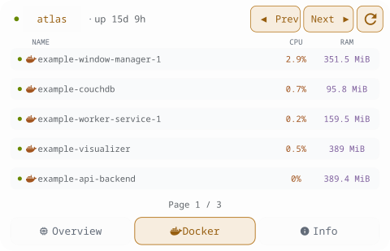</td>
      <td align="center">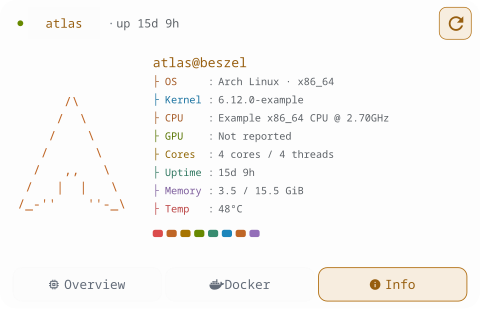</td>
    </tr>
    <tr><th align="left">Ayu Mirage</th>
      <td align="center">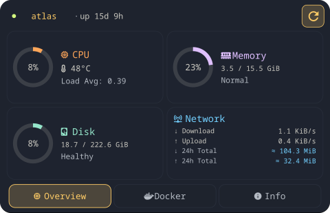</td>
      <td align="center">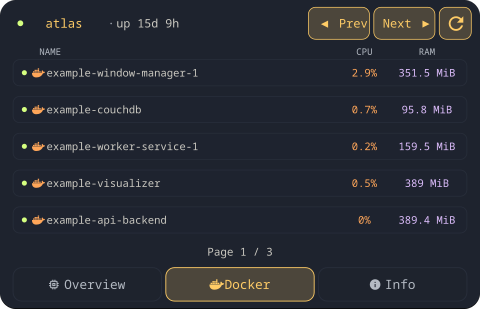</td>
      <td align="center">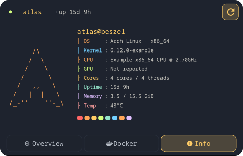</td>
    </tr>
    <tr><th align="left">Catppuccin Frappé</th>
      <td align="center">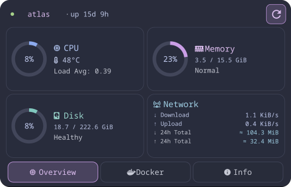</td>
      <td align="center">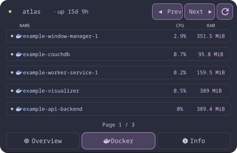</td>
      <td align="center">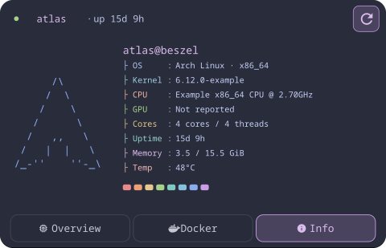</td>
    </tr>
    <tr><th align="left">Catppuccin Latte</th>
      <td align="center">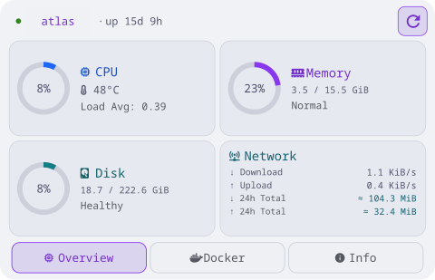</td>
      <td align="center">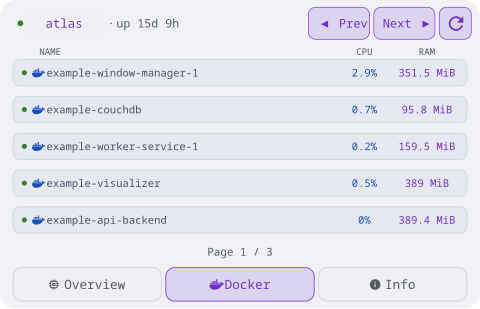</td>
      <td align="center">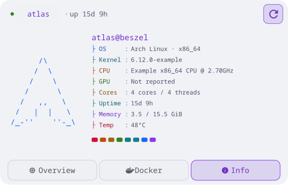</td>
    </tr>
    <tr><th align="left">Catppuccin Macchiato</th>
      <td align="center">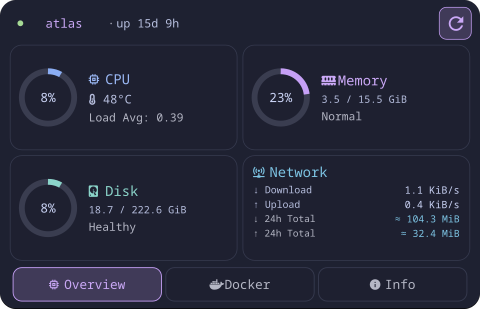</td>
      <td align="center">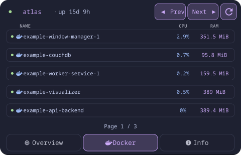</td>
      <td align="center">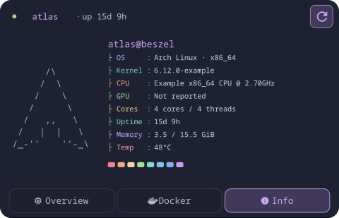</td>
    </tr>
    <tr><th align="left">Everforest Dark</th>
      <td align="center">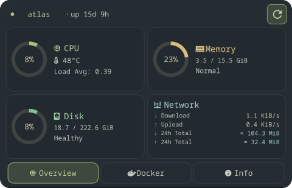</td>
      <td align="center">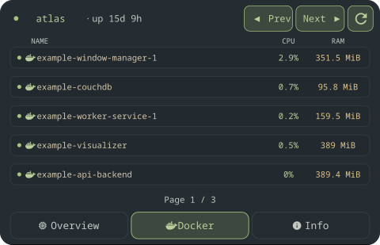</td>
      <td align="center">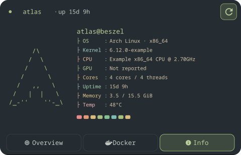</td>
    </tr>
    <tr><th align="left">Everforest Light</th>
      <td align="center">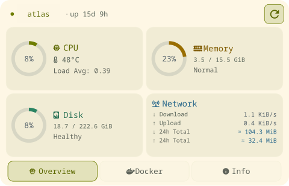</td>
      <td align="center">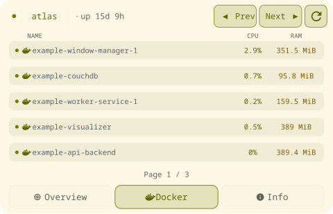</td>
      <td align="center">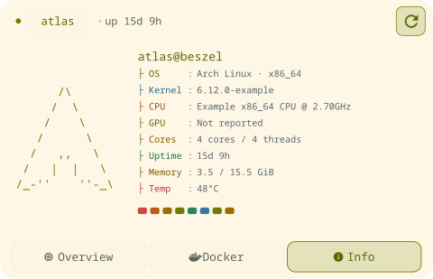</td>
    </tr>
    <tr><th align="left">Gruvbox Light</th>
      <td align="center">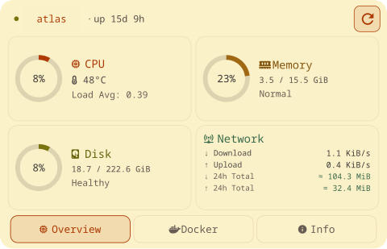</td>
      <td align="center">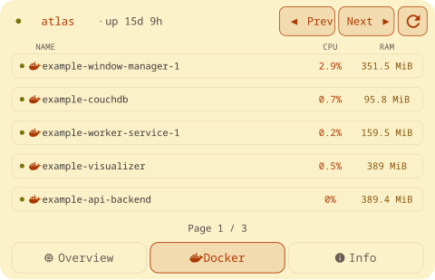</td>
      <td align="center">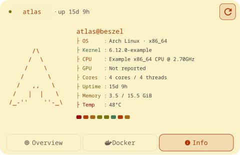</td>
    </tr>
    <tr><th align="left">Kanagawa Dragon</th>
      <td align="center">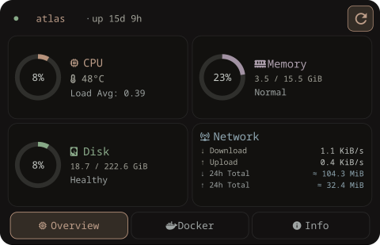</td>
      <td align="center">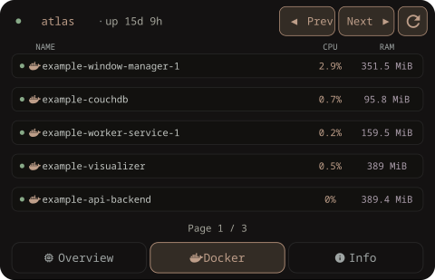</td>
      <td align="center">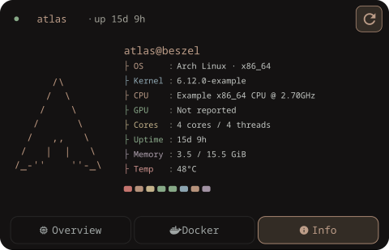</td>
    </tr>
    <tr><th align="left">Kanagawa Lotus</th>
      <td align="center">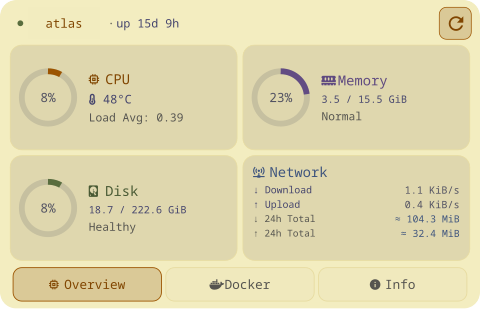</td>
      <td align="center">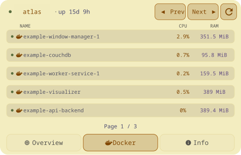</td>
      <td align="center">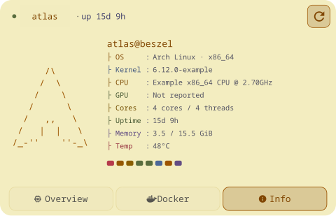</td>
    </tr>
    <tr><th align="left">Kanagawa Wave</th>
      <td align="center">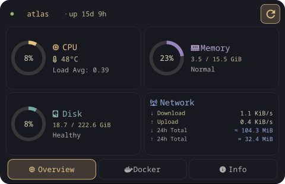</td>
      <td align="center">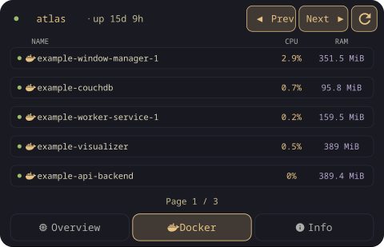</td>
      <td align="center"></td>
    </tr>
    <tr><th align="left">Monokai</th>
      <td align="center">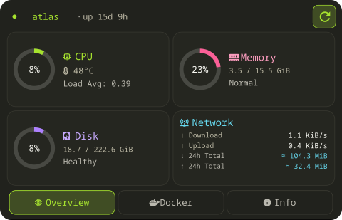</td>
      <td align="center">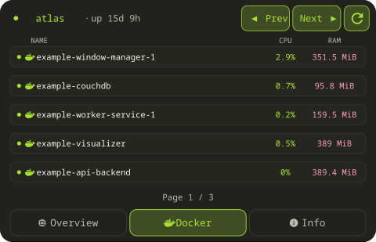</td>
      <td align="center">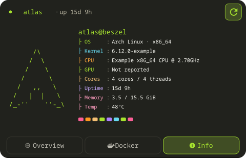</td>
    </tr>
    <tr><th align="left">Nightfox</th>
      <td align="center">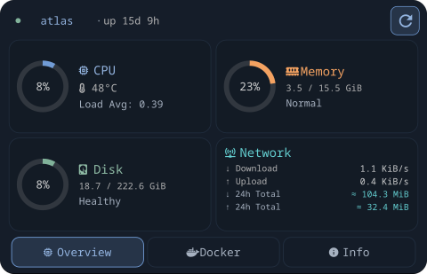</td>
      <td align="center">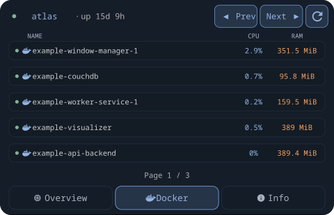</td>
      <td align="center">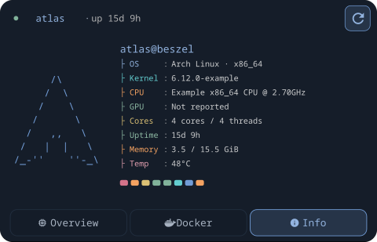</td>
    </tr>
    <tr><th align="left">Nord</th>
      <td align="center">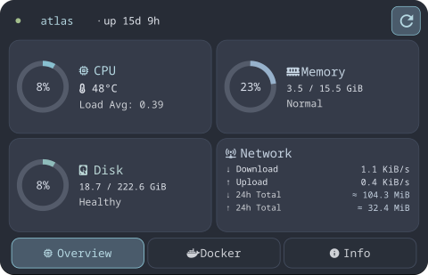</td>
      <td align="center">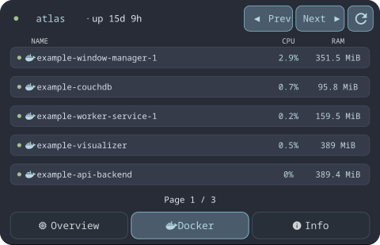</td>
      <td align="center">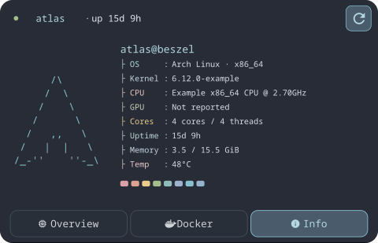</td>
    </tr>
    <tr><th align="left">One Dark</th>
      <td align="center">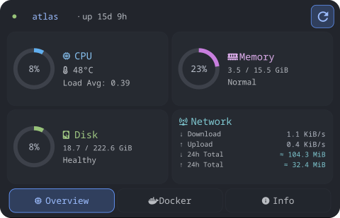</td>
      <td align="center">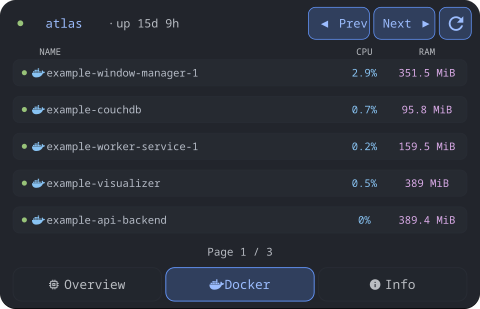</td>
      <td align="center"></td>
    </tr>
    <tr><th align="left">One Light</th>
      <td align="center">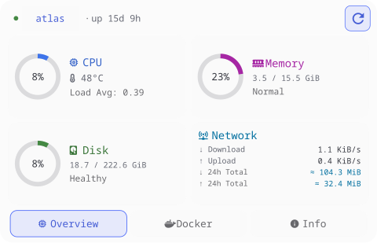</td>
      <td align="center">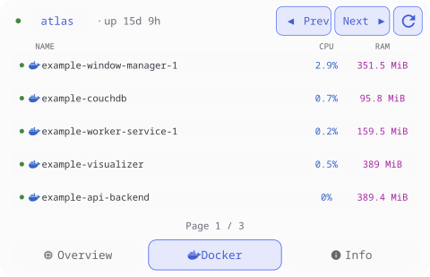</td>
      <td align="center">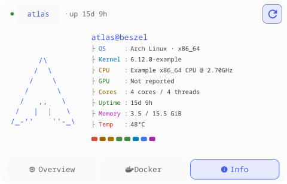</td>
    </tr>
    <tr><th align="left">Oxocarbon Dark</th>
      <td align="center">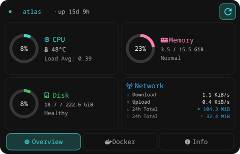</td>
      <td align="center"></td>
      <td align="center"></td>
    </tr>
    <tr><th align="left">Material Palenight</th>
      <td align="center"></td>
      <td align="center"></td>
      <td align="center"></td>
    </tr>
    <tr><th align="left">Rosé Pine Dawn</th>
      <td align="center"></td>
      <td align="center"></td>
      <td align="center"></td>
    </tr>
    <tr><th align="left">Rosé Pine Moon</th>
      <td align="center"></td>
      <td align="center"></td>
      <td align="center"></td>
    </tr>
    <tr><th align="left">Rosé Pine</th>
      <td align="center"></td>
      <td align="center"></td>
      <td align="center"></td>
    </tr>
    <tr><th align="left">Solarized Dark</th>
      <td align="center"></td>
      <td align="center"></td>
      <td align="center"></td>
    </tr>
    <tr><th align="left">Solarized Light</th>
      <td align="center"></td>
      <td align="center"></td>
      <td align="center"></td>
    </tr>
    <tr><th align="left">Tokyo Night Moon</th>
      <td align="center"></td>
      <td align="center"></td>
      <td align="center"></td>
    </tr>
    <tr><th align="left">Tokyo Night Storm</th>
      <td align="center"></td>
      <td align="center"></td>
      <td align="center"></td>
    </tr>
    <tr><th align="left">Tokyo Night</th>
      <td align="center"></td>
      <td align="center"></td>
      <td align="center"></td>
    </tr>
    <tr><th align="left">Tomorrow Night</th>
      <td align="center"></td>
      <td align="center"></td>
      <td align="center"></td>
    </tr>
  </tbody>
</table>
